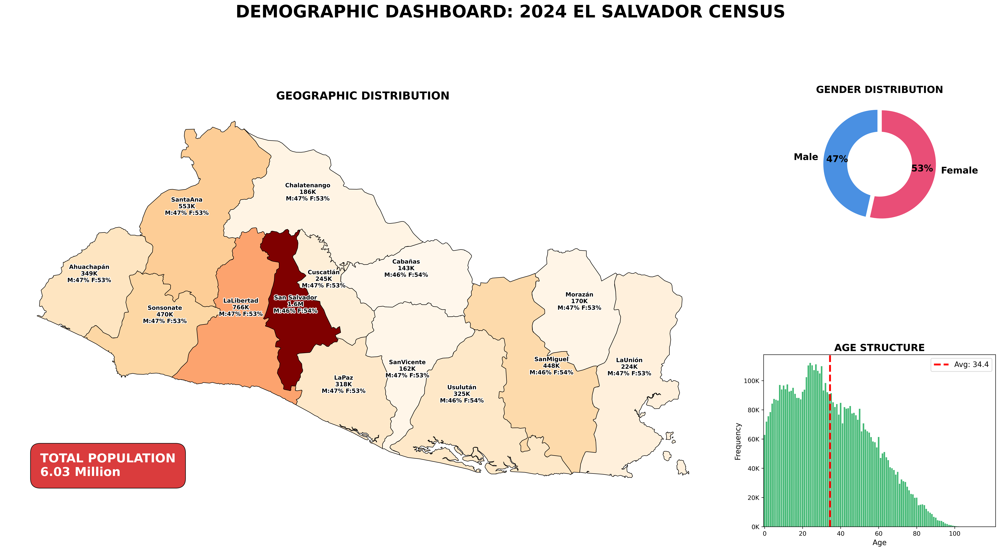
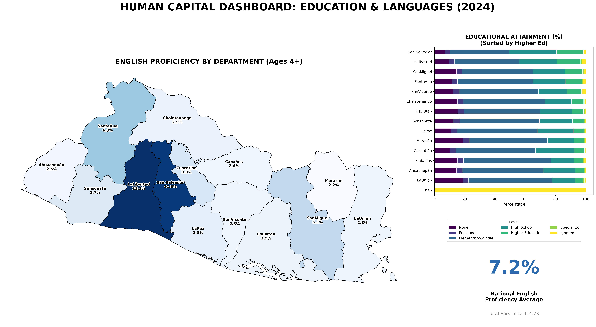
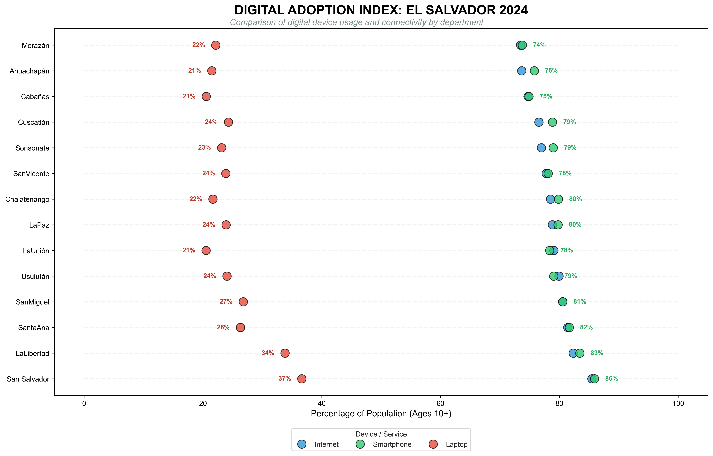

## Introduction

This report presents key findings from the **2024 Population and Housing Census**. The analysis focuses on demographic distribution, human capital, and digital adoption, leveraging microdata processed entirely with Python and R.

---

## 1. Demographic Profile: National Distribution

El Salvador's population stands at **6.03 million**, with a significant concentration in the country's central region. The following dashboard details the geographic distribution by department, gender composition, and age structure (population pyramid).

---

## 2. Human Capital: Education & Bilingualism

Human capital is the engine of economic development. This analysis reveals a clear correlation between access to higher education and English language proficiency, highlighting San Salvador and La Libertad as the primary hubs for highly skilled talent.

---

## 3. The Digital Divide: Connectivity vs. Productivity

While internet access exceeds 70% in most departments, a critical gap remains in personal computer (laptop) ownership. This disparity suggests high digital consumption via smartphones, but poses a challenge for desktop-based productivity and specialized technical work.

---

## Technical Conclusion

This project demonstrates an end-to-end **Data Science** workflow designed for high-stakes decision making:

1. **Extraction:** High-volume processing of raw census microdata.
2. **Transformation:** Data cleaning and normalization of geographic entities.
3. **Visualization:** Generation of high-resolution static dashboards (`400 DPI`) for executive reporting.
4. **Deployment:** Integration into a Quarto environment for professional web publishing.